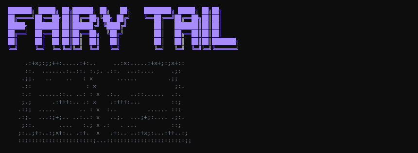
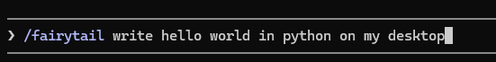
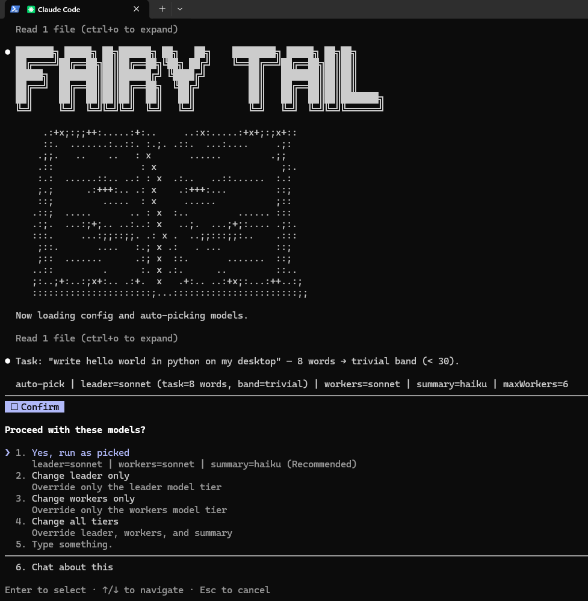
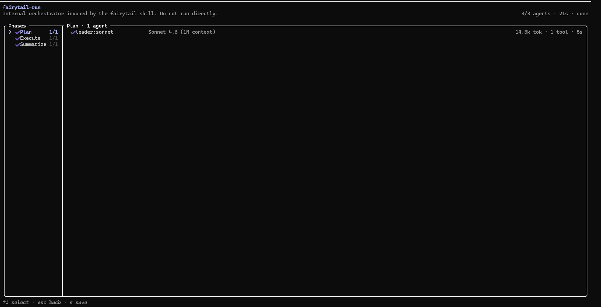

<div align="center">



# Fairytail

**Orchestrated multi-agent pipeline for Claude Code CLI.**

[](LICENSE)
[](https://github.com/michelesanfilippo/fairytail/actions/workflows/test.yml)
[](https://codecov.io/gh/michelesanfilippo/fairytail)
[]()
[]()

*The right model for the right job. Leader reasons. Workers execute. Summary reports.*

</div>

---

## How it works

```
  /fairytail --leader=fable  <task>
        │
        ├─ auto-pick models  (complexity-based)
        ├─ detect stack personas  (java, dba, devops, …)
        ├─ cost estimate  (~$X.XXX)
        ├─ confirm  →  grill-me if context is thin
        ↓

  ╔═════════════════════════════════════════════════════════╗
  ║  PHASE 1  ·  LEADER   (model: fable / opus)            ║
  ╠═════════════════════════════════════════════════════════╣
  ║  · analyzes task + decomposes into N workers  (max 6)  ║
  ║  · assigns persona, role, prompt, dependsOn            ║
  ╚════════════════════════╦════════════════════════════════╝
                           ║  spawns N workers in parallel
             ┌─────────────╬─────────────┐
             ↓             ↓             ↓

  PHASE 2  ·  WORKERS  (model: sonnet)

  ┌──────────────┐   ┌──────────────┐   ┌──────────────┐
  │  java worker │◄─►│  dba worker  │◄─►│  qa worker   │  ·· ≤ 6
  │ Senior Java  │   │ Senior DBA   │   │ Senior QA    │
  └──────┬───────┘   └──────┬───────┘   └──────┬───────┘
         │       peer context (dependsOn)       │
         └─────────────────┬────────────────────┘
                           ↓
  ╔═════════════════════════════════════════════════════════╗
  ║  PHASE 3  ·  SUMMARY   (model: haiku)                  ║
  ╠═════════════════════════════════════════════════════════╣
  ║  · aggregates all artifacts + produces caveman report  ║
  ╚════════════════════════╦════════════════════════════════╝
                           ↓
  ┌─────────────────────────────────────────────────────────┐
  │  tl;dr  ·  sections  ·  next steps  ·  warnings        │
  │  no emoji  ·  no filler  ·  terse but complete         │
  └─────────────────────────────────────────────────────────┘
```

**1. Invoke**



**2. Banner + auto-pick + confirm**



**3. Workflow (Plan → Execute → Summarize)**



---

## Install

**macOS / Linux**
```bash
curl -fsSL https://raw.githubusercontent.com/michelesanfilippo/fairytail/main/install.sh | bash -s -- --scope global
```

**Windows (PowerShell)**
```powershell
irm https://raw.githubusercontent.com/michelesanfilippo/fairytail/main/install.ps1 | iex
```

> Prefer reviewing before running? Clone the repo and run `install.sh` / `install.ps1` manually.  
> Project-scoped install (`./.claude/`): add `--scope project` / `-Scope project` to the command.

---

## Features

| Feature | Description |
|---|---|
| **Cost tiering** | Leader = expensive (reasoning), Workers = mid, Summary = cheap |
| **Persona workers** | Detects stack from task (java, dba, devops, …) — assigns expert persona to each worker |
| **Cost estimate** | Pre-run `~$X.XXX` estimate shown before confirm |
| **Grill-me** | Leader self-assesses confidence; interviews user if context is thin (max 3 rounds) |
| **Plan cache** | Fingerprints task; reuses leader plan on similar tasks — skips most expensive agent |
| **Model override** | Full CLI control: `--leader=fable --workers=haiku --summary=sonnet` |
| **Peer context** | Workers with `dependsOn` receive upstream artifacts as context |
| **Caveman style** | No emoji, no filler, keywords + lists — enforced across all agents |

---

## Usage

```
/fairytail <task>
/fairytail --leader=fable <task>
/fairytail --workers=haiku --summary=sonnet <task>
/fairytail --max-workers=3 <task>
```

**Auto-selection** — leader picked by multi-signal complexity score (0–100):

| Signal | Max pts | What it measures |
|---|---|---|
| Distinct technical domains detected | 30 | java + db + devops = 3 domains |
| Architectural complexity markers | 25 | migrate, microservice, distributed, greenfield, … |
| Scope / ambiguity markers | 20 | entire, production-ready, end-to-end, … |
| Technical depth (keyword hits) | 15 | how many stack keywords matched |
| Word count | 10 | weak tiebreaker |

| Score | Leader | When |
|---|---|---|
| 0–30 | `sonnet` | trivial, single-domain, clear scope |
| 31–65 | `opus` | moderate complexity, 1-2 domains |
| 66–100 | `fable` | multi-domain, architectural, ambiguous scope |

Override at any time: `--leader=fable`

---

## Model tiers

| Tier | Default | Allowed | Role |
|---|---|---|---|
| Leader | `fable` | `fable`, `opus`, `sonnet` | Reasoning, decomposition |
| Workers | `sonnet` | `sonnet`, `haiku`, `opus`, `fable` | Parallel execution |
| Summary | `haiku` | `haiku`, `sonnet` | Report aggregation |

Model ids resolve to the latest available version at session time.  
To change defaults: edit `~/.claude/fairytail.config.json`. See `docs/CONFIG.md`.

---

## Requirements

- [Claude Code CLI](https://docs.anthropic.com/claude-code)
- `Workflow` tool available in session (built-in to Claude Code)
- Access to at least `sonnet` + `haiku` in your model catalog

---

## Manual install

**Windows (PowerShell 7+)**
```powershell
.\install.ps1 -Scope global
.\install.ps1 -Scope project -Force
```

**macOS / Linux**
```bash
./install.sh --scope global
./install.sh --scope project --force
```

**Uninstall**
```powershell
.\uninstall.ps1 -Scope global -KeepConfig
```
```bash
./uninstall.sh --scope global --keep-config
```

---

## Docs

- [docs/ARCHITECTURE.md](docs/ARCHITECTURE.md) — orchestration, phases, schemas
- [docs/CONFIG.md](docs/CONFIG.md) — full config reference

---

## License

MIT — see [LICENSE](LICENSE).
